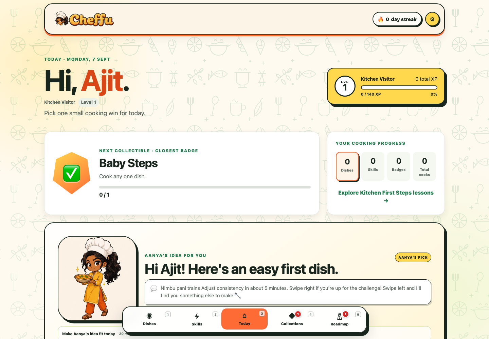
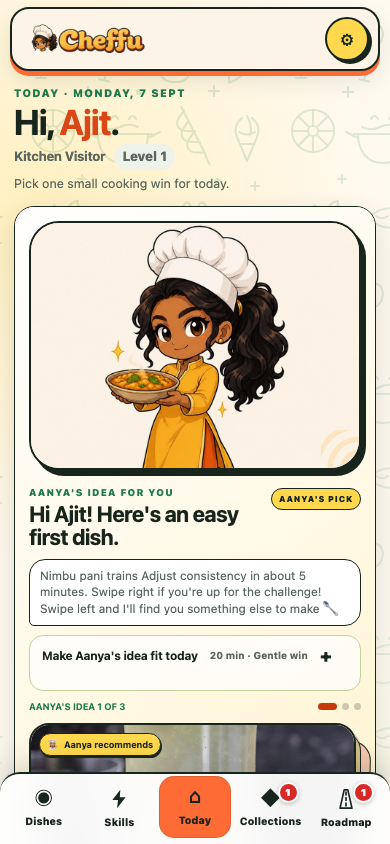
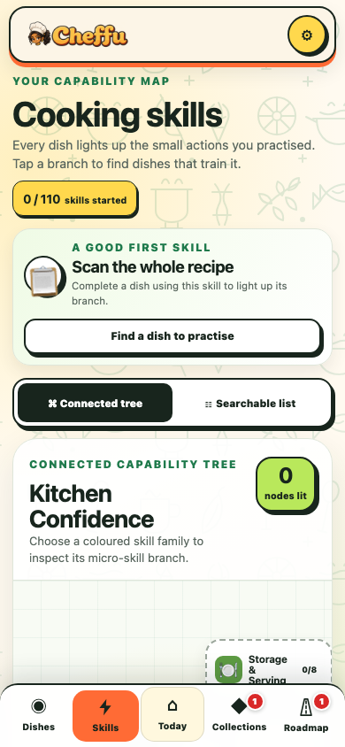
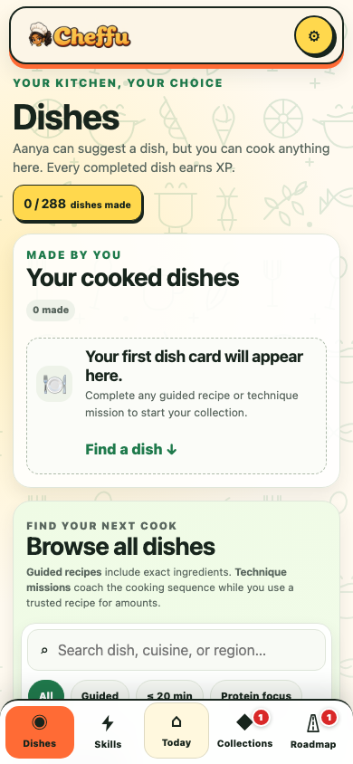
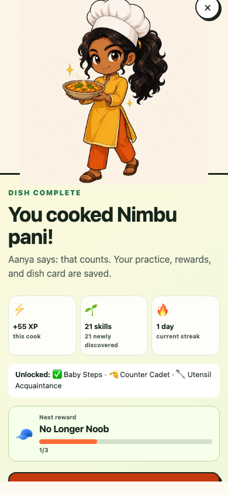

<p align="center">
  
</p>

<p align="center">
  <strong>A playful cooking RPG that turns complete kitchen beginners into confident everyday cooks.</strong>
</p>

<p align="center">
  Browser-first · Mobile-friendly · No build step · Local-first progress
</p>

<p align="center">
  <a href="https://cheffu.vercel.app/"><strong>Open the live app →</strong></a>
</p>

## Product preview

<p align="center">
  <a href="https://cheffu.vercel.app/"></a>
</p>

<p align="center">
  
  
  
</p>

<p align="center"><sub>Today · Connected skill tree · Searchable dish library</sub></p>

<p align="center">
  
</p>

<p align="center"><sub>A completed cook awards XP, develops skills, extends the streak, and moves the next reward forward.</sub></p>

## What is Cheffu?

Cheffu is a static cooking game designed for beginner cooks in India, especially protein-conscious young adults who have never felt comfortable in a kitchen. It starts with tiny wins such as mixing a drink, then gradually introduces heat, pans, tadka, pressure cooking, curries, dough, fermentation, and complete meals.

The experience combines practical cooking instructions with XP, levels, micro-skills, collectible dish cards, badges, titles, daily recommendations, and a friendly companion named Aanya.

## Highlights

- **377 cooking missions** across Indian regional food, protein-focused meals, desserts, baking, and international cuisines.
- **124 granular kitchen skills**, including measuring tools, mixing methods, knife actions, heat cues, cooker safety, fermentation, plating, and meal planning.
- **Eight progression stages**, from no-heat first contact to coordinated full meals.
- **A daily quest deck** with three recommendations matched to the player's diet and current progress.
- **Swipe, button, and keyboard controls** to accept a quest or pass to the next recommendation.
- **Safe interactive checkpoints** that bank partial XP without demanding interaction during dangerous actions.
- **100 unlockable titles** with humorous descriptions and distinct achievement conditions.
- **Dish cards, badges, regional collections, an India map, and a world cooking passport.**
- **Responsive five-view interface** with keyboard shortcuts for desktop players.
- **Friendly Aanya commentary** that explains the most useful next action using the player's live progress.

## Main views

**Dishes, `1`**  
A visual collection of everything the player has successfully cooked, including cook counts and recipe descriptions.

**Skills, `2`**  
A colour-coded connected tree and searchable list covering every micro-skill the player has practised.

**Today, `3`**  
The daily dashboard with level progress, closest collectible, badge cabinet, and Aanya's quest deck. Accept a recommendation, pass to the next one, or change an accepted quest before cooking. The choice stays locked in for the day and resets when the player's diet preference changes.

**Collections, `4`**  
Badges, 100 titles, regional food collections, the India State Plate, and World Kitchen Passport.

**Roadmap, `5`**  
Twenty guided cooking specialities plus the full catalogue, organised across eight difficulty stages.

## Run locally

Cheffu has no package installation or build step. Serve the folder through any static web server:

```bash
python3 -m http.server 4180 --bind 127.0.0.1
```

Then open [http://127.0.0.1:4180](http://127.0.0.1:4180).

Opening `index.html` directly is not recommended because browsers restrict some asset behaviour on `file://` URLs.

## Verify the content

The verification script checks catalogue integrity, skill links, collections, titles, imagery, navigation, Aanya assets, daily quest interactions, and core progression requirements:

```bash
node verify.mjs
```

The current verified content includes:

- 377 recipes
- 124 micro-skills
- 8 progression stages
- 6 core badges
- 100 collectible titles

## Deploy

Cheffu can be hosted as a static site on Netlify, Cloudflare Pages, GitHub Pages, Vercel, or any ordinary web server.

For Netlify:

1. Import this repository or drag the project folder into Netlify Drop.
2. Leave the build command empty.
3. Set the publish directory to the repository root.
4. Deploy.

No backend or environment variables are required for the current prototype.

## Project structure

```text
Cheffu/
├── index.html                  App shell and navigation
├── styles.css                 Responsive visual system
├── app.js                     State, rendering, interactions, and game loop
├── data.js                    Core recipes, stages, skills, and badges
├── catalog-expansion.js       Expanded 370-dish catalogue and collections
├── recipe-photos.js           Local recipe imagery with source credits
├── title-catalog.js           100 unlockable titles
├── verify.mjs                 Automated content validation
├── assets/                    Decorative interface assets
├── aanya-variations/          Aanya's cooking expressions
├── scripts/                   Catalogue image research utilities
├── CURRICULUM.md              Cooking curriculum rationale
└── *_PROMPT.md                Reusable character and logo briefs
```

## Progress and privacy

This prototype stores the player name and all game progress in browser `localStorage`.

- Saves are private to that browser profile.
- Progress does not currently sync across devices.
- Clearing browser data removes the save.
- The app sends no player account data to a Cheffu backend because no backend exists yet.

A production version will need authentication and cloud storage for cross-device saves, persistent photo submissions, AI grading, or social features.

## Food and nutrition notes

Recipes are concise training missions for a prototype. Protein values are approximate per serving and are not medical or dietary advice. Players should follow normal food-safety practices around raw meat, eggs, hot oil, steam, pressure cookers, allergens, and food storage.

## Image attribution

Dish photography is researched per recipe and stored locally for reliable loading. Every acquired Wikimedia Commons image retains its source page and licence metadata in `assets/recipes/manifest.json`.

Map sources:

- [India states and union territories](https://commons.wikimedia.org/wiki/File:India_states_and_union_territories_map.svg), Planemad and contributors, CC BY-SA 3.0.
- [World map configurable](https://commons.wikimedia.org/wiki/File:World_map_configurable.svg), Heitordp, CC0.

The original Cheffu wordmark and Aanya character assets were created for this prototype. Reusable generation briefs are available in [`CHEFFU_LOGO_PROMPT.md`](CHEFFU_LOGO_PROMPT.md) and [`AANYA_COMPANION_PROMPTS.md`](AANYA_COMPANION_PROMPTS.md).

## Current status

Cheffu is a functional product prototype intended for usability testing. The next production milestone is cloud-backed accounts and persistent cooking submissions while preserving the fast, low-friction daily loop.
